# Modal Window

_This tutorial shows how to build a modal window step by step_

An example of a component can be viewed **[demo](https://eu.backendlessappcontent.com/8AAA8E74-06F7-48FD-9154-1AA3227BFA24/D8E91033-BD89-40C0-9FD9-126973003E38/files/web/app/index.html?page=Modal)**

## Disclaimer

The names for the classes and elements in this component are used for example. You can do whatever you like.

***

## Structure

Let's start assembling the modal window by creating the component structure on the **User interface** tab.

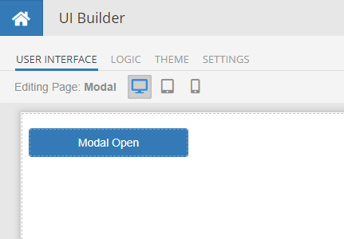

The general structure of the component is shown below. For clarity, element **IDs** are named the same as classes.

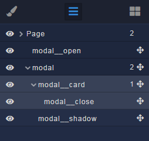

### Descriptions blocks
- **modal__open** - button for opening a modal window, any of your custom solutions
- **modal** - root element of the modal, **required** element
    - **modal__card** - root block for your content, inside this element put what you need, a **required** element
        - **modal__close** - button to close the modal window, you can do as you need
    - **modal__shadow** - shading curtain behind the modal window, restricts access to other elements of the page, **required** element

All elements of the component, except buttons, use the **Block** element.

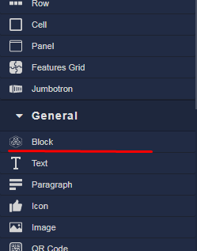

For the buttons I used the **Button** element, but you can use whatever you want.

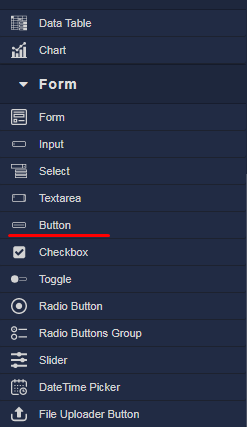

When creating elements **immediately assign ID and Classes** according to the structure


**After you create the entire structure of the component** you need to reset all settings for the elements. To do this, you need to delete all the selected properties, later we will indicate the necessary ones through the styles. Set the **Padding** and **Margin** properties to 0 and then reset them as well. Some properties cannot be reset, just skip this)

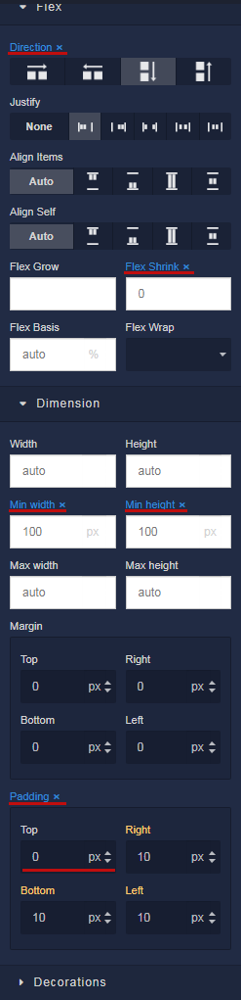

***

## Styles

To create styles, switch to the **Theme** tab. Inside the page, select the **Editor** and **Extensions** tabs

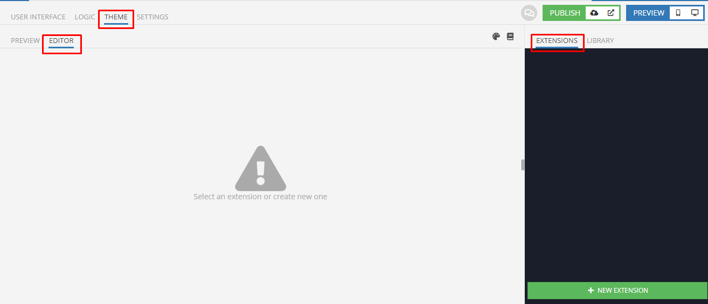

We create Extensions. You can use the names as you like.

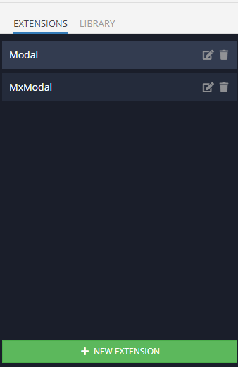

Extension **MxModal** is a less-mixin in which the basic styles of the component are taken out for ease of multiple use. Edit if you know what you are doing!

```less
.mx-modal {
    display: none !important;
    position: fixed !important;
    top: 0 !important;
    bottom: 0 !important;
    left: 0 !important;
    right: 0 !important;
    z-index: 1000 !important;
    flex-direction: column !important;
    justify-content: center !important;
    align-items: center !important;
    width: 100% !important;
    height: 100% !important;
    padding: 0 15px !important;

    &.open {
        display: flex !important;
    }

    @media (min-width: 768px) {
        padding: 0 !important;
    }
}

.mx-modal__curtain {
    position: fixed !important;
    top: 0 !important;
    bottom: 0 !important;
    left: 0 !important;
    right: 0 !important;
    z-index: -1 !important;
    background-color: rgba(0, 0, 0, 0.7);
    width: 100% !important;
    height: 100% !important;
}
.mx-modal__card {
    width: 100% !important;

    @media (min-width: 768px) {
        width: 600px !important;
    }
}
```

The Extension ** Modal ** contains the general styling of the component on the page according to your project. The most important thing is to import mixins, do the rest of the properties as you like.

```less
.modal__open {
    width: 200px !important;
}
.modal {
    .mx-modal();
}
.modal__card {
    .mx-modal__card();

    flex-direction: column !important;
    justify-content: flex-end !important;
    align-items: flex-end !important;
    background-color: #fff;
    height: 300px !important;
    border-radius: 5px;
    box-shadow: 0px 3px 1px -2px rgba(0, 0, 0, 0.20), 
                0px 2px 2px 0px rgba(0, 0, 0, 0.14), 
                0px 1px 5px 0px rgba(0, 0, 0, 0.12);
}
.modal__close {
    width: 200px !important;
}
.modal__shadow {
    .mx-modal__curtain();
}
```
***

## Logic

Let's start adding logic from the root **Page** element, for this we return to the **User interface** tab, select the **Page** element and click on the puzzle icon as in the screenshot.

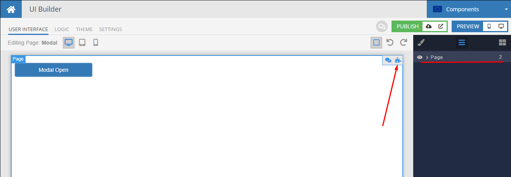

In the **Logic** tab that opens for the **Page** element, we hang the logic on the **On Page Enter** event as in the screenshot. This will create a global modal state variable **isOpenModal** for the entire page. We set the value to **False**, which in our logic will define a closed modal window.

If you want to use several different modals, add a unique variable for each window.

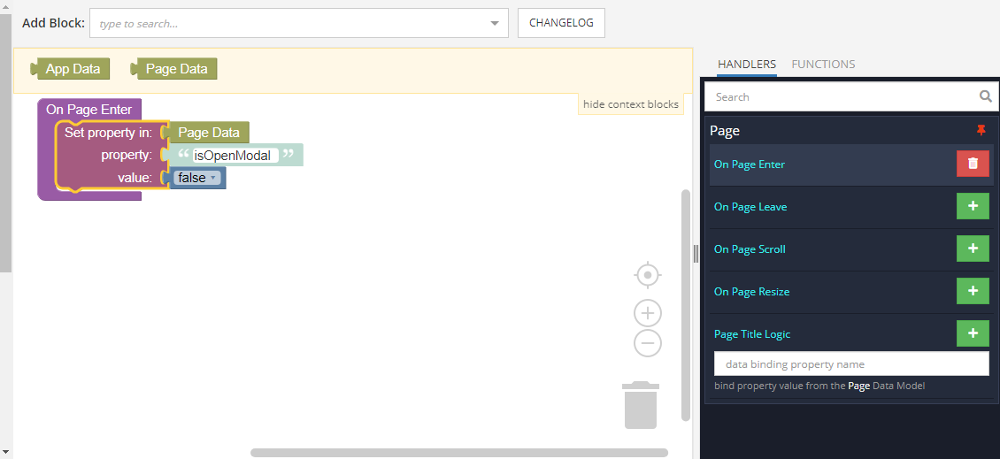

In order not to switch between tabs to select the following items, we will use the navigator. To do this, unpin the Page element by clicking on the button icon.

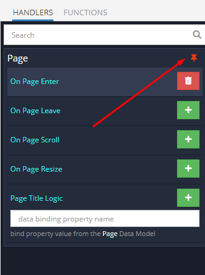

Now we add logic for the rest of the elements.

On the window open button, use the **On Click Event**. Set the **isOpenModal** variable to **True**

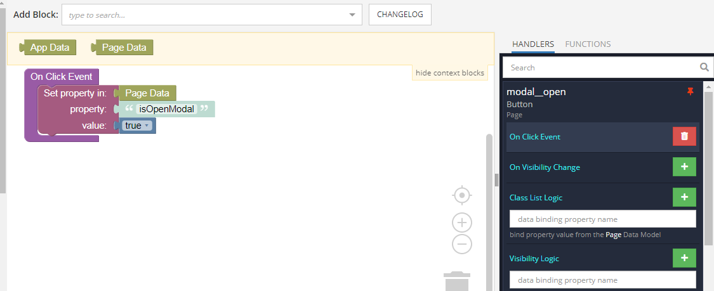

Similarly, add a handler for the **On Click Event** for the close button and shade curtain.

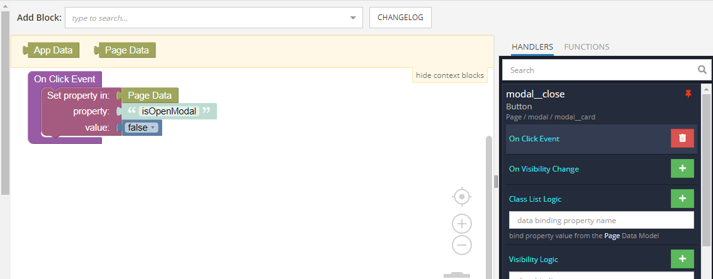
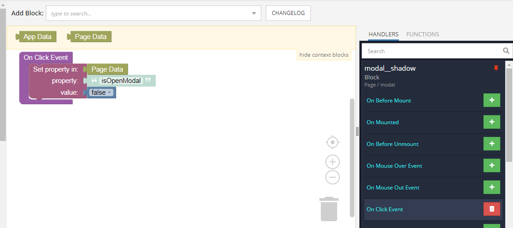

It remains to add logic to the element with the **modal** class. For this we use the **Class List Logic** event. Here, depending on the value of the **isOpenModal** variable, the **open** class is added or removed.

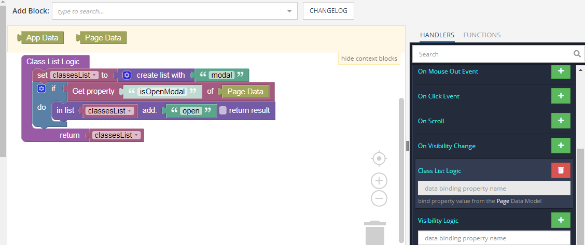
***

I hope that you found this useful and as always happy codeless coding!
